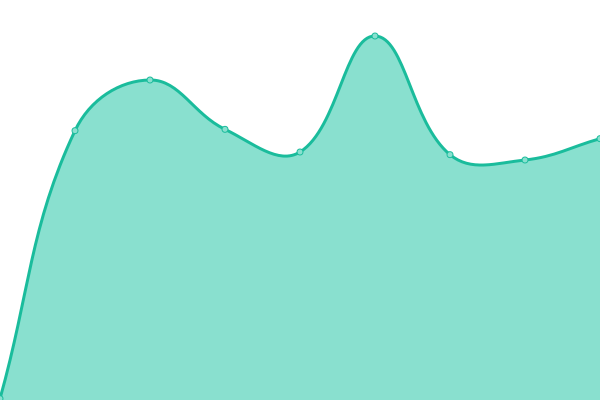

# [📈 Live Status](https://status.ory.sh): <!--live status--> **🟧 Partial outage**

This repository contains the open-source uptime monitor and status page for [ORY](http://www.ory.sh/), powered by [Upptime](https://github.com/upptime/upptime).

With [Upptime](https://upptime.js.org), you can get your own unlimited and free uptime monitor and status page, powered entirely by a GitHub repository. We use [Issues](https://github.com/ory/status/issues) as incident reports, [Actions](https://github.com/ory/status/actions) as uptime monitors, and [Pages](https://status.ory.sh) for the status page.

<!--start: status pages-->
<!-- This summary is generated by Upptime (https://github.com/upptime/upptime) -->
<!-- Do not edit this manually, your changes will be overwritten -->
<!-- prettier-ignore -->
| URL | Status | History | Response Time | Uptime |
| --- | ------ | ------- | ------------- | ------ |
|  [Website](https://www.ory.sh) | 🟩 Up | [website.yml](https://github.com/ory/status/commits/HEAD/history/website.yml) | 

 489ms
     
 | 

<a href="https://status.ory.sh/history/website">100.00%</a>
    

|  [Kubernetes Helm Charts](http://k8s.ory.sh/helm/) | 🟩 Up | [kubernetes-helm-charts.yml](https://github.com/ory/status/commits/HEAD/history/kubernetes-helm-charts.yml) | 

 52ms
     
 | 

<a href="https://status.ory.sh/history/kubernetes-helm-charts">100.00%</a>
    

|  [Ory Console](https://console.ory.sh/) | 🟥 Down | [ory-console.yml](https://github.com/ory/status/commits/HEAD/history/ory-console.yml) | 

 268ms
     
 | 

<a href="https://status.ory.sh/history/ory-console">5.63%</a>
    

|  [Ory Kratos API](https://project.console.ory.sh/api/kratos/public/health/ready) | 🟩 Up | [ory-kratos-api.yml](https://github.com/ory/status/commits/HEAD/history/ory-kratos-api.yml) | 

 257ms
     
 | 

<a href="https://status.ory.sh/history/ory-kratos-api">100.00%</a>
    

|  Ory Demo (Legacy) | 🟩 Up | [ory-demo-legacy.yml](https://github.com/ory/status/commits/HEAD/history/ory-demo-legacy.yml) | 

 771ms
     
 | 

<a href="https://status.ory.sh/history/ory-demo-legacy">100.00%</a>
    

|  Ory Kratos API (Staging) | 🟥 Down | [ory-kratos-api-staging.yml](https://github.com/ory/status/commits/HEAD/history/ory-kratos-api-staging.yml) | 

 683ms
     
 | 

<a href="https://status.ory.sh/history/ory-kratos-api-staging">99.99%</a>
    

|  Ory Console (Staging) | 🟩 Up | [ory-console-staging.yml](https://github.com/ory/status/commits/HEAD/history/ory-console-staging.yml) | 

 237ms
     
 | 

<a href="https://status.ory.sh/history/ory-console-staging">100.00%</a>
    

|  [Slack Invite Bot](https://slack.ory.sh/) | 🟩 Up | [slack-invite-bot.yml](https://github.com/ory/status/commits/HEAD/history/slack-invite-bot.yml) | 

 89ms
     
 | 

<a href="https://status.ory.sh/history/slack-invite-bot">100.00%</a>
    

|  SQA Web API | 🟩 Up | [sqa-web-api.yml](https://github.com/ory/status/commits/HEAD/history/sqa-web-api.yml) | 

 395ms
     
 | 

<a href="https://status.ory.sh/history/sqa-web-api">100.00%</a>
    

|  SQA API | 🟩 Up | [sqa-api.yml](https://github.com/ory/status/commits/HEAD/history/sqa-api.yml) | 

 56ms
     
 | 

<a href="https://status.ory.sh/history/sqa-api">100.00%</a>
    

|  [Corsar API](https://corsar.ory.sh/orgs/ory/repos?__host=api.github.com&__proto=https&per_page=10&page=1) | 🟩 Up | [corsar-api.yml](https://github.com/ory/status/commits/HEAD/history/corsar-api.yml) | 

 81ms
     
 | 

<a href="https://status.ory.sh/history/corsar-api">100.00%</a>
    

<!--end: status pages-->

[**Visit our status website →**](https://status.ory.sh)

## 📄 License

- Powered by: [Upptime](https://github.com/upptime/upptime)
- Code: [MIT](./LICENSE) © [ORY](http://www.ory.sh/)
- Data in the `./history` directory: [Open Database License](https://opendatacommons.org/licenses/odbl/1-0/)
